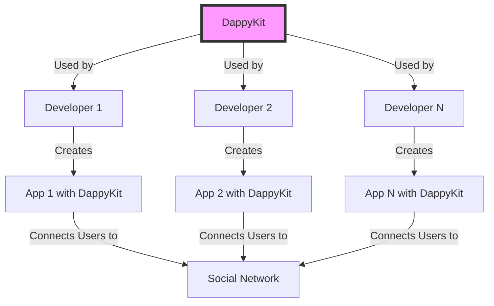

# Getting Started

**DappyKit** is a combination of technologies that allows for the creation of a decentralized social network with 1 billion users at a reasonable maintenance cost. Every developer using DappyKit gains access to all the users of other developers. All the applications from all developers are united into one social network.

## Idea

* Top Web2 social networks today are not what Web3 social networks will look like in the future.
* Web3 needs to be bold, emotional, and useful. 
* All applications in a Web3 network are a "union of peoples with different cultures and mentalities". 
* It's better to create a bold application for a small audience and solve their problems than to create applications for everyone and solve no one's problems.

